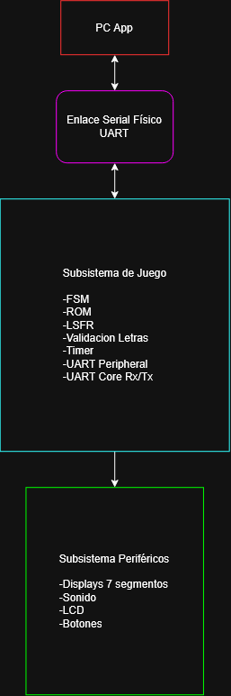
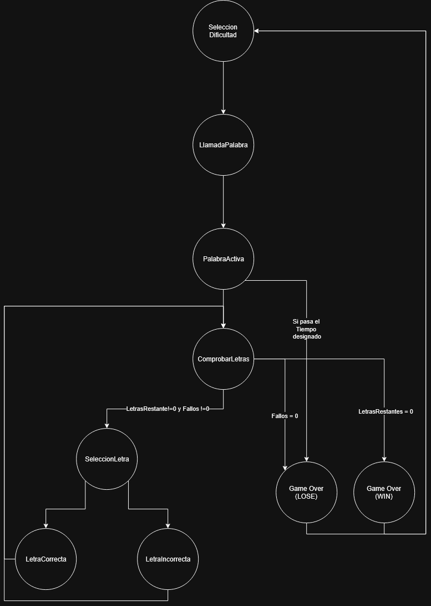
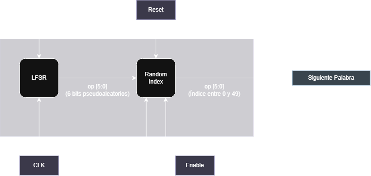

## Diagrama de Bloques
---

## PC App
---

## Subsistema de Juego
---
El subsistema de juego es el encargado de manejar la lógica principal del juego, además de gestionar la aplicación utilizada remotamente desde la PC. Este subsistema también se encarga de la comunicación entre la FPGA y la PC App mediante el periférico UART, permitiendo el envío y recepción de información a través de una conexión física por cable.

### FSM del Juego
---

|  **Estado Actual**   |                               **Condición de Salto**                               |                                                      **Accion a Realizar**                                                       |                **Salto a Realizar**                 |
| :------------------: | :--------------------------------------------------------------------------------: | :------------------------------------------------------------------------------------------------------------------------------: | :-------------------------------------------------: |
| Selección Dificultad |           Se ha iniciado el juego o se ha presionado el botón de RESET.            |                          Se tiene que elegir alguno de los niveles de dificultad: fácil  o difícil.                           |                   LlamadaPalabra                    |
|    LlamadaPalabra    |                       Se selecciono el nivel de dificultad.                        |                                    Se realiza una lectura de la palabra desde el modulo ROM.                                     |                    PalabraActiva                    |
|    PalabraActiva     |                    Se recibió correctamente la palabra a usar.                     |                            Se espera la selección de una letra del jugador o que el tiempo se acabe.                             |         ComprobarLetras/ GameOver(Lose)          |
|   ComprobarLetras    | El juego se ha iniciado o se ha realizado el procesamiento de la letra presionada. | Se tiene que comprobar que la cantidad de letras restantes sean iguales o diferentes a cero, lo mismo con la cantidad de fallos. | SeleccionLetra/ GameOver(LOSE)/ GameOver(Win) |
|    LetraCorrecta     |                  La letra presionada se encuentra en la palabra.                   |  Se procesa la letra, desde mostrar la letra en el LCD en los espacios que corresponde hasta bajar el numero de LetrasRestante.  |                   ComprobarLetras                   |
|   LetraIncorrecta    |                 La letra presionada no se encuentra en la palabra.                 |      Se procesa la letra, desde mostrar la letra en el LCD en los espacios que corresponde hasta bajar el numero de Fallos.      |                   ComprobarLetras                   |
|    GameOver(LOSE)    |     El jugador se ha quedado sin Fallos disponibles o se ha acabado el tiempo      |     Se tiene que permanecer en este estado por 3 segundos, seguido de las acciones correspondientes al estado GameOver(LOSE)     |                 SeleccionDificultad                 |
|    GameOver(WIN)     |           El jugador ha logrado adivinar todas las letras de la palabra            |     Se tiene que permanecer en este estado por 3 segundos, seguido de las acciones correspondientes al estado GameOver(WIN)      |                 SeleccionDificultad                 |
### ROM
---
Este módulo es el encargado de almacenar las palabras que se utilizarán durante la partida. A partir de un índice de entrada, el módulo entrega la palabra correspondiente junto con su longitud, permitiendo que esta sea utilizada como la palabra por adivinar. Las palabras se almacenan utilizando un ancho fijo capaz de representar hasta 12 caracteres.
Para el almacenamiento de las palabras se necesita considerar los siguientes datos:
- Índice: Estos bits son el ID de cada una de las palabras, debido a que son 50 palabras, se puede deducir que se necesitaran 6 bits:
  $$2^6 = 64$$
  Esto corresponde a la cantidad suficiente para almacenar todas. Por lo que se tendría un índice de tipo $$\texttt{indice[5:0]}$$
- Palabra: Cada una de las palabras tienen una cantidad de letras distintas, sin embargo, se sabe que el máximo que puede tener cada una de las letras es de 12 caracteres, y además se sabe que cada uno de estos caracteres tiene formato ASCII, por lo que se ocupan 8 bits de representación: 
  $$12 \text{ caracteres} \times 8 \text{ bits} = 96 \text{ bits}$$
  Se tiene entonces: 
  $$\texttt{palabra[95:0]}$$
- Longitud: Este dato no es estrictamente necesario, sin embargo, ayuda a descifrar cuantas letras tiene realmente la palabra, ya que si por ejemplo, la palabra es "HOLA", el resto de bits tiene que ser rellenado con algo más, por lo que se puede enviar un dato adicional que indica que solamente las 4 primeras letras se usan.
   $$\texttt{largo[4:0]}$$

Aquí tienes la sección redactada en formato Markdown, enfocada en la explicación del funcionamiento sin incluir bloques de código:

### Selector de Índice vía LFSR

Para garantizar una selección pseudoaleatoria y no determinista de las palabras del banco (ROM) en cada partida, el subsistema incluye un generador pseudoaleatorio basado en un Registro de Desplazamiento con Retroalimentación Lineal (*Linear Feedback Shift Register*, LFSR) junto con un módulo de adecuación de rango para limitar los valores generados.

#### 1. Generador LFSR (`Lfsr.sv`)

El módulo `Lfsr` implementa un registro de 6 bits (`OUTPUT_BITS = 6`) utilizando una topología Fibonacci. Genera una secuencia pseudoaleatoria de longitud máxima ($2^6 - 1 = 63$ estados distintos) antes de repetirse.

* **Ecuación de Retroalimentación:**
  El bit de realimentación (`feedback`) se calcula mediante la operación XOR entre los bits más significativos del registro:
  $$\text{feedback} = \text{lfsr reg}[5] \oplus \text{lfsr reg}[4]$$

* **Prevención de Estado Nulo:**
  Un LFSR basado en compuertas XOR colapsa permanentemente si entra al estado `6'b000000`. Para evitar esto, ante la señal de reinicio (`rst`), el registro se inicializa en la semilla distinta de cero `6'b000001` (`0x01`).
---

#### 2. Módulo Limitador de Rango (`Random_index.sv`)

Dado que el banco de palabras en la memoria ROM contiene un máximo de 50 elementos (índices válidos del `0` al `49`) y el LFSR de 6 bits abarca valores del `1` al `63`, se aplica una técnica de **rechazo de muestras** (*rejection sampling*):

1. El LFSR opera continuamente ciclo a ciclo en segundo plano.
2. Al activarse la señal de habilitación (`enable`) proveniente de la FSM principal al cambiar de estado, el módulo evalúa si la salida instantánea `op` del LFSR se encuentra dentro del rango válido (`op < 50`).
3. Si el valor es menor a 50, se captura y actualiza el valor de salida `word_index`. Si el valor es mayor o igual a 50 (entre 50 y 63), la lectura se descarta en ese ciclo hasta que el LFSR avance a un número menor a 50.

---
### Validación Letras

---

### Timer

---

### Comunicación Serial (UART)
Para establecer el enlace de comunicación bidireccional entre la FPGA y la PC (a través de la aplicación en Python), el sistema utiliza un periférico UART de 32 bits mapeado a memoria. Este bloque integra los núcleos de transmisión (`UART_tx`) y recepción (`UART_rx`) en VHDL con una interfaz SystemVerilog estandarizada.

#### 1. Módulo Transmisor UART (`UART_tx.vhd`)

El núcleo `UART_tx` realiza la conversión de datos paralelos de 8 bits a una trama serie asíncrona estándar (1 bit de inicio, 8 bits de datos, 1 bit de parada, sin paridad).

* **Generación de Baud Rate (115200 Baudios):**
  Para un reloj de sistema de 100 MHz, el divisor de reloj se calcula mediante la relación:
  $$	ext{BAUD\_CLK\_TICKS} = rac{f_{	ext{clk}}}{	ext{Baud Rate}} = rac{100 	imes 10^6 	ext{ Hz}}{115200 	ext{ baud}}  pprox 868.06 \implies 868$$

* **Detección de Pulso y Transmisión:**
  Un proceso interno (`tx_start_detector`) captura impulsos en la señal `tx_start`. Al detectarse la activación, el dato a transmitir se almacena en el registro `stored_data` y la FSM avanza secuencialmente enviando el bit de *START* (`'0'`), los 8 bits de datos desde el LSB hasta el MSB, y finaliza con el bit de *STOP* (`'1'`). La señal `tx_rdy` notifica la finalización del envío.

---

#### 2. Módulo Receptor UART (`UART_rx.vhd`)

El núcleo `UART_rx` procesa la señal serie de entrada `rx` y la convierte a un formato paralelo de 8 bits empleando un esquema de sobremuestreo por un factor de 16 ($16	imes$).

* **Generación de Reloj de Sobremuestreo ($16	imes$):**
  El número de ciclos de reloj de 100 MHz por cada pulso del reloj de sobremuestreo se define como:
  $$	ext{BAUD\_X16\_CLK\_TICKS} = rac{f_{	ext{clk}}}{	ext{Baud Rate} 	imes 16} = rac{100 	imes 10^6 	ext{ Hz}}{115200 	imes 16}  pprox 54.25 \implies 54$$

* **Muestra en el Centro del Bit:**
  Al detectar la transición a '0' del bit de *START*, la FSM del receptor espera 7 ciclos del reloj de sobremuestreo para posicionar el punto de muestreo exactamente en el centro de la duración del bit. Posteriormente, efectúa lecturas cada 16 pulsos del reloj sobremuestreado para reconstruir el byte completo en `rx_stored_data`. Cuando se valida el bit de *STOP*, se genera un pulso de un ciclo en `rx_data_rdy`.

---

#### 3. Adaptación a la Interfaz de Bus y Comunicación con Python (`uart_sv_wrapper.sv`)

El *wrapper* SystemVerilog expone la interfaz de registros de 32 bits hacia la lógica de control de la FPGA y gestiona la interacción bidireccional con la PC a través de un puerto serie virtual sobre USB.

* **Mapa de Registros Mapeado a Memoria:**

| Dirección (`addr_i[1:0]`) | Registro | Tipo | Descripción |
| :---: | :---: | :---: | :--- |
| `2'b00` | **DATOS 0** | R/W | `wdata_i[7:0]`: Byte cargado para transmisión por TX. |
| `2'b01` | **DATOS 1** | RO | `rdata_o[7:0]`: Último byte recibido por RX. |
| `2'b10` | **CONTROL** | R/W | `bit 0`: **send** (WC/P) - Dispara TX. Auto-limpiable en fin de TX. `bit 1`: **new_rx** (R/W) - Flag de nuevo dato recibido. |

* **Protocolo de Enlace Bidireccional con Python (`pyserial`):**
  La comunicación opera de forma bidireccional full-duplex sobre el enlace UART a 115200 baudios:
  1. **Recepción desde Python (PC $	o$ FPGA):** La aplicación Python envía un carácter en formato ASCII que representa la letra adivinada por el usuario. Cuando el módulo `UART_rx` captura la trama completa, activa `rx_data_rdy`. El *wrapper* almacena el byte en `rx_data` y coloca la bandera `new_rx` en `1`. La FSM principal lee el registro `DATOS 1` y posteriormente escribe un `'0'` en el bit `new_rx` de `CONTROL` para limpiar el flag.
  2. **Transmisión hacia Python (FPGA $	o$ PC):** La FSM de la FPGA escribe la respuesta (inicio de partida, acierto/error, patrón actualizado de la palabra, intentos restantes o resultado final) en el registro `DATOS 0` y setea el bit `send` (bit 0 del registro `CONTROL`). El *wrapper* emite un pulso en `tx_start_pulse` hacia `UART_tx` e inicia la serialización de la trama. Al terminar el envío, el hardware borra automáticamente el bit `send`.
---
## Subsistema Periféricos
---
### Displays 7 Segmentos

### Sonido Y LEDs
---
### LCD
---
### Botones
---
