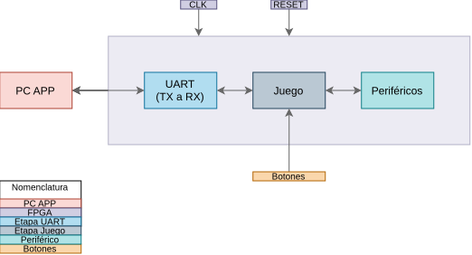
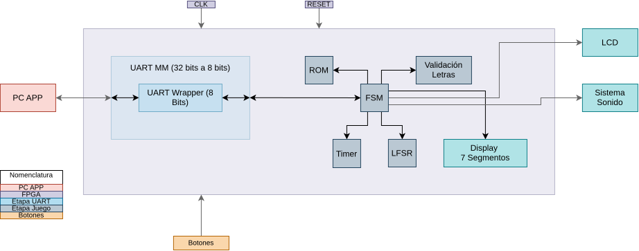

## Diagrama de Bloques
---
### Diagrama de primer nivel

  

### Diagrama de Segundo Nivel

  

### Diagrama de Tercer Nivel

  

## PC App

---
El PC App es el encargado de recibir los inputs directos del jugador, en este caso la letra seleccionada, validar que esta sea una entrada permitida y enviarla a la FPGA mediante la conexión física y el sistema de comunicación UART. Una vez recibida, la letra es procesada por la FPGA para aplicar la lógica correspondiente del juego. La aplicación también recibe desde la FPGA información sobre el estado de la partida y la muestra al jugador. Este programa se desarrollará exclusivamente en el lenguaje de programación Python.
## Subsistema de Juego
---
---
El subsistema de juego es el encargado de manejar la lógica principal del juego, además de gestionar la aplicación utilizada remotamente desde la PC. Este subsistema también se encarga de la comunicación entre la FPGA y la PC App mediante el periférico UART, permitiendo el envío y recepción de información a través de una conexión física por cable.

### FSM del Juego
---

|  **Estado Actual**   |                               **Condición de Salto**                               |                                                      **Accion a Realizar**                                                       |                **Salto a Realizar**                 |
| :------------------: | :--------------------------------------------------------------------------------: | :------------------------------------------------------------------------------------------------------------------------------: | :-------------------------------------------------: |
| Selección Dificultad |           Se ha iniciado el juego o se ha presionado el botón de RESET.            |                          Se tiene que elegir alguno de los niveles de dificultad: fácil  o difícil.                           |                   LlamadaPalabra                    |
|    LlamadaPalabra    |                       Se selecciono el nivel de dificultad.                        |                                    Se realiza una lectura de la palabra desde el modulo ROM.                                     |                    PalabraActiva                    |
|    PalabraActiva     |                    Se recibió correctamente la palabra a usar.                     |                            Se espera la selección de una letra del jugador o que el tiempo se acabe.                             |         ComprobarLetras/ GameOver(Lose)          |
|   ComprobarLetras    | El juego se ha iniciado o se ha realizado el procesamiento de la letra presionada. | Se tiene que comprobar que la cantidad de letras restantes sean iguales o diferentes a cero, lo mismo con la cantidad de fallos. | SeleccionLetra/ GameOver(LOSE)/ GameOver(Win) |
|    LetraCorrecta     |                  La letra presionada se encuentra en la palabra.                   |  Se procesa la letra, desde mostrar la letra en el LCD en los espacios que corresponde hasta bajar el numero de LetrasRestante.  |                   ComprobarLetras                   |
|   LetraIncorrecta    |                 La letra presionada no se encuentra en la palabra.                 |      Se procesa la letra, desde mostrar la letra en el LCD en los espacios que corresponde hasta bajar el numero de Fallos.      |                   ComprobarLetras                   |
|    GameOver(LOSE)    |     El jugador se ha quedado sin Fallos disponibles o se ha acabado el tiempo      |     Se tiene que permanecer en este estado por 3 segundos, seguido de las acciones correspondientes al estado GameOver(LOSE)     |                 SeleccionDificultad                 |
|    GameOver(WIN)     |           El jugador ha logrado adivinar todas las letras de la palabra            |     Se tiene que permanecer en este estado por 3 segundos, seguido de las acciones correspondientes al estado GameOver(WIN)      |                 SeleccionDificultad                 |
#### ROM

Entradas: word_index[5:0]

Salidas: palabra[95:0] y largo[4:0]

Módulo encargado de almacenar las 50 palabras disponibles para el juego. A partir del índice recibido selecciona una palabra y entrega tanto sus caracteres como su longitud. Cada palabra utiliza un ancho fijo de 96 bits, suficiente para almacenar hasta 12 caracteres ASCII de 8 bits.

#### LFSR

Entradas: clk y rst

Salidas: op[5:0]

Módulo encargado de generar una secuencia pseudoaleatoria de 6 bits utilizada para variar la selección de palabras entre partidas. El registro avanza en cada ciclo de reloj utilizando una realimentación obtenida mediante una operación XOR entre dos bits del registro. Durante el reinicio se utiliza una semilla distinta de cero para evitar que el LFSR permanezca bloqueado en el estado 000000.

#### Random_index

Entradas: clk, rst, enable y hardmode

Salidas: word_index[5:0]

Módulo encargado de convertir el valor generado por el LFSR en un índice válido para la ROM. Cuando enable se activa, selecciona y almacena un nuevo índice. En modo fácil permite seleccionar cualquiera de las 50 palabras disponibles, mientras que en modo difícil utiliza únicamente los índices correspondientes a palabras con más de cinco caracteres.

#### LetraVali

Entradas: palabra[95:0], largo[4:0] y letra[7:0]

Salidas: acierto y coincidencias[11:0]

Módulo encargado de comparar la letra recibida con cada una de las posiciones válidas de la palabra seleccionada. La salida acierto indica si la letra aparece al menos una vez, mientras que coincidencias[11:0] indica específicamente las posiciones donde fue encontrada.

Por ejemplo, para la palabra CASA, si se recibe la letra A, las posiciones correspondientes a ambas letras A son activadas en coincidencias, permitiendo revelar simultáneamente todas sus apariciones en el LCD.

#### Timer

Entradas: clk, rst, hardmode, GameOn y Active

Salidas: TimerS[5:0] y TimeOut

Módulo encargado de controlar el tiempo disponible durante cada partida. Al comenzar una nueva partida carga 60 segundos en modo fácil o 45 segundos en modo difícil. Mientras Active se mantenga activo, realiza la cuenta regresiva una vez por segundo.

Cuando el tiempo llega a cero activa TimeOut, señal utilizada por la máquina de estados para finalizar la partida con una derrota. TimerS contiene el tiempo restante y también es utilizado por el sistema de periféricos para mostrarlo en los displays de 7 segmentos.

### UART
#### Comunicación Serial (UART)
Para establecer el enlace de comunicación bidireccional entre la FPGA y la PC (a través de la aplicación en Python), el sistema utiliza un periférico UART de 32 bits mapeado a memoria. Este bloque integra los núcleos de transmisión (`UART_tx`) y recepción (`UART_rx`) en VHDL con una interfaz SystemVerilog estandarizada.

#### UART_GENERADOR_BAUDIOS
Entradas: clk y reset

Salidas: s_tick

Genera el pulso utilizado para la temporalización de los módulos de transmisión y recepción de la UART, utilizando específicamente 115200 baudios. 

#### UART_RX

Entradas: clk, reset, rx y s_tick

Salidas: dout[7:0] y rx_done_tick

Recibe la trama de la UART y convierte los datos serializado es el byte paralelo de 8 bits, de esta manera, detecta el bit de inicio y realiza el muestreo de los 8 bits de la información y verifica cuando se recibe el bit que indica la parada. 

#### UART_TX

Entradas: clk, reset, tx_start, s_tick y din[7:0]

Salidas: tx y tx_done_tick

Recibe el byte paralelo de 8 bits y se encarga de convertirlo en la trama serializada.

#### UART_WRAPPER

Entradas: clk, reset, rx, tx_start y din[7:0]

Salida: tx, dout[7:0], rx_done_tick y tx_done_tick

Es el encargado de integrar los 3 modulos anteriores en un solo dispositivo, proporcionando lo necesario para que se pueda realizar correctamente el enlace serial.

#### UART_PERIPH

Entradas: clk, reset, rx, addr, write_data y write_enable

Salidas: tx y read_data

Proporciona una interfaz de registros para el control de la UART

#### UART_RX_CONTROL

Entradas: clk, reset y uart_rdata

Salidas: LetraUART[7:0] y NuevaLetra

Consulta de manera constante el periférico de la UART para determinar si se recibió un nuevo byte. Cuando se recibe un dato nuevo, se almacena, limpia la flag y genera un pulso de aviso.

#### UART_TX_CONTROL

Entradas: clk, reset, data_byte y interfaz UART

Salidas: Interfaz UART y done

Convierte el identificador de mensaje en una secuencia de caracteres ASCII y los envia

#### UART_MM_ARBITER

Entradas: Interfaz de UART_TX_CONTROL y UART_RX_CONTROL, Datos del Periferico

Salidas: Interfaz de UART_PERIPH

Controla el acceso compartido a UART_PERIPH, ademas de determinar si el bus deberia ser utilizado por el RX o TX/

UART_EVENTOS

Entrdas: clk, reset, GameOn, hardmode, Fallos[2:0], LetrasReveladas[11:0], GameWin, GameLose y mensaje_busy

Salidas: mensaje_start y mensaje_id[2:0]

Detecta los eventos que el mismo juego produce y determina que mensaje tiene que ser enviado a la aplicación de la PC.

UART_CONTROL

Entradas: clk, reset, rx, mensaje_start y mensaje_id[2:0]

Salidas: tx, LetraUART[7:0], NuevaLetra, mensaje_busy y mensaje_done

Modulo principal de todo el sistema UART, el cual integra todo el resto de los módulos en un solo dispositivo, permitiendo asi la comunicación entre la PC y la FPGA

## Subsistema Periféricos
---
---

### Displays 7 Segmentos
---
El módulo `Display7seg` controla cuatro displays de siete segmentos mediante multiplexación. Utiliza un divisor de reloj parametrizable para activar cada dígito de forma secuencial, con una frecuencia de refresco predeterminada de 1000 Hz por dígito.

Los cuatro dígitos muestran dos valores en formato BCD: las unidades y decenas de victorias (`wins_ones` y `wins_tens`), y las unidades y decenas del tiempo restante (`time_ones` y `time_tens`). El módulo también incluye un decodificador BCD a siete segmentos para representar los valores del 0 al 9. Los ánodos y segmentos trabajan con lógica activa en bajo, mientras que el punto decimal permanece apagado.

Controlador de los 4 digitos de 7 segmentos propios de la Basys3 (activos en bajo, tanto segmentos como anodos). Multiplexa los 4 digitos a una tasa de refresco fija derivada del reloj de 100 MHz, de forma imperceptible al ojo humano (sin parpadeo).

Asignacion sugerida (documentar en el informe si se cambia):
-an[3] (mas a la izquierda) -> time_tens   (decenas de segundos restantes)
-an[2]                      -> time_ones   (unidades de segundos restantes)
-an[1]                      -> wins_tens   (decenas de partidas ganadas)
-an[0] (mas a la derecha)   -> wins_ones   (unidades de partidas ganadas)

Cada entrada de digito es un valor BCD de 0 a 9 (4 bits).
seg[6:0] = {g,f,e,d,c,b,a}, activo en bajo (patron estandar deanodo comun). dp se deja siempre apagado (activo en bajo -> '1').

Diagrama tercer nivel

---------------------------------------------------------
A continuación se procede con el diagrama de cuarto nivel:

a) Nombre del módulo: seven_seg_mux

b) Diagrama modular:

C) Objetivo: Multiplexar 4 dígitos BCD sobre el único bus de segmentos y las 4 líneas de ánodo de los displays físicos de la Basys3, refrescando a una tasa suficientemente alta para que el ojo humano perciba los 4 dígitos encendidos de forma simultánea.

D) Entradas: 

| Señal | Ancho | Descripcion |
| :---: | :---: | :---: |
| clk | 1 | 	Reloj de sistema|
| rst | 1 | reset sincrono |
| times_tens, times_ones | 4 | 	Dígitos BCD del tiempo restante |
| wins_tens, wins_ones | 4 | 	Dígitos BCD de las partidas ganadas |

E) Salidas: 

| Señal | Ancho | Descripcion |
| :---: | :---: | :---: |
| seg[6:0] | 7 | 	Patrón de segmentos activo en bajo |
| dp | 1 | Punto decimal (siempre apagado) |
| an[3:0] | 4 | Selector de ánodo activo en bajo |

f) Relación con otros módulos: Recibe sus 4 entradas BCD directamente de la FSM de control principal (temporizador de cuenta regresiva y contador de partidas ganadas). No depende de ningún otro periférico local; es un bloque de solo salida hacia el hardware físico de la tarjeta.

g) Explicación de funcionamiento: Un contador de refresco genera un pulso de habilitación (tick_en) cada CLK_FREQ_HZ / REFRESH_HZ ciclos. Ese pulso avanza un contador módulo 4 (digit_sel) que recorre cíclicamente los 4 dígitos. Según el valor de digit_sel, un multiplexor 4:1 selecciona cuál de los 4 valores BCD mostrar y, en paralelo, un decodificador binario a one-hot activa la línea de ánodo correspondiente. El valor BCD seleccionado pasa a un decodificador combinacional que lo traduce al patrón de 7 segmentos.

h) Diseño: Este es el único bloque puramente combinacional de diseño propio del módulo (el resto son contadores y un multiplexor estándar). Segmentos activos en bajo, orden seg = {g,f,e,d,c,b,a}:

No requiere simplificación booleana adicional: es una ROM combinacional de 10 entradas válidas, implementada como case en SystemVerilog; el sintetizador la mapea directamente a LUTs.

### Sonido Y LEDs
---
El módulo `Buzzer` genera una onda cuadrada para producir sonidos asociados a los eventos principales del juego. Sus entradas `Acierto`, `Fallo` y `GameOver` activan, respectivamente, los siguientes tonos:

| Evento | Frecuencia | Duración |
| :---: | :---: | :---: |
| Acierto | 2000 Hz | 150 ms |
| Fallo | 500 Hz | 250 ms |
| Game Over | 300 Hz | 1000 ms |

El módulo permite que solo un tono esté activo a la vez y devuelve la salida `buzzer` a cero al finalizar la duración configurada.

El módulo `status_led` utiliza una entrada de dos bits (`game_state`) para indicar visualmente el estado general del juego mediante un banco de 16 LEDs. En el estado de selección de modo se enciende `led[0]`, durante la partida se enciende `led[1]` y al mostrar el resultado final se enciende `led[2]`. Los demás LEDs permanecen apagados.

Diagrama tercer nivel buzzer.

------------------------------------------------------------

Diagrama terecer nivel leds.

------------------------------------------------------------

A continuación se procede con el diagrama de cuarto nivel del buzzer:

A) Nombre del módulo: buzzer_driver

B) Diagrama modular:

c) Objetivo: Generar una onda cuadrada de frecuencia y duración distintas según el evento del juego recibido (letra correcta, letra incorrecta, victoria, derrota), para alimentar un buzzer pasivo.

D) Entradas: 

| Señal | Ancho | Descripcion |
| :---: | :---: | :---: |
| clk | 1 | 	Reloj de sistema|
| rst | 1 | reset sincrono |
| correct_pulse, incorrect_pulse | 1 | 	pulso de 1 ciclo desde la fsm control |
| win_pulse, lose_pulse | 1 | 	Dpulso de 1 ciclo desde la fsm control |

E) Salidas: 

| Señal | Ancho | Descripcion |
| :---: | :---: | :---: |
| buzzer_pwm  | 1 | 	Onda cuadrada hacia el buzzer pasivo  |

F) Relación con otros módulos: Los 4 pulsos de entrada provienen de la FSM de control principal, generados en el mismo ciclo en que se valida una letra o se determina el resultado de la partida. No depende de ningún otro periférico local.

G) Explicación de funcionamiento: El selector de evento decide, con prioridad fija (correct > incorrect > win > lose), cuál frecuencia (semiperiodo) y duración cargar; también reinicia el tono si llega un nuevo evento mientras uno anterior aún suena. El contador de duración cuenta hacia atrás desde el valor cargado y, al llegar a cero, desactiva el tono. En paralelo, el contador de ciclos cuenta hasta el semiperiodo cargado y, al alcanzarlo, dispara al biestable de salida para que alterne buzzer_pwm, generando así la onda cuadrada de la frecuencia deseada

H9 Diseño: Este bloque no tiene lógica combinacional de diseño propio que amerite una tabla de verdad: es un conjunto de contadores y comparadores numéricos parametrizados. El diseño se documenta en su lugar mediante las fórmulas usadas para calcular los parámetros de cada tono a partir de la frecuencia y duración deseadas:

semiperiodo (ciclos) = CLK_FREQ_HZ / (2 × frecuencia_Hz)

duración   (ciclos) = CLK_FREQ_HZ × (duración_ms / 1000)

------------------------------------------------------------

A continuación se procede con el diagrama de cuarto nivel del led:

a) Nombre del módulo: status_led

b) Diagrama modular:

c) objetivo: indicar, mediante un LED distinto y de forma mutuamente excluyente, en cuál de las 3 fases se encuentra el sistema: selección de modo, partida activa, o resultado final.

d) entradas:

| Señal | Ancho | Descripcion |
| :---: | :---: | :---: |
| game_state | 2 | Código de fase actual del juego |

e) salidas: 

| Señal | Ancho | Descripcion |
| :---: | :---: | :---: |
| led[15:0] | 16 | 		LEDs de la Basys3; solo led[2:0] se usan  |

f) Relación con otros módulos: game_state proviene directamente de la FSM de control principal del juego (Ahorcado); es un bloque puramente de despliegue, sin retroalimentación hacia el resto del sistema.

g) Explicación de funcionamiento:  tres comparadores combinacionales evalúan en paralelo si game_state es igual a cada uno de los 3 códigos válidos, y cada resultado se conecta directamente a un bit distinto de led. Al ser mutuamente excluyentes por construcción, nunca hay más de un LED encendido a la vez.

h) 

### LCD
El subsistema LCD se encarga de mostrara mensajes en la pantalla. Durante la primera etapa de selección de dificultad, alterna entre los mensajes de “FACIL” y “DIFICIL”, permitiendo al usuario elegir entre ambas opciones, al finalizar esta etapa el subsistema se encarga de escribir guiones bajos que representen cada letra de la palabra escogida pseudoaleatoriamente. En la segunda etapa el juego ya ha empezado, aquí el sistema recibe una letra, la cantidad de veces que se repite y cada una de sus ubicaciones, de esta forma se va formando la palara conforme el usuario acierte. Finalmente, una vez el juego ha terminado, se le indica al usuario si perdió o gano.

#### Máquina de estados
La siguiente máquina de estados tiene la función de escribir los caracteres que reciba, se planea que funcione independientemente de forma que sea capaz de escribir lo que se necesita independientemente del estado en que se encuentre el juego.  La primera parte de la FSM corresponde a una inicialización por instrucciones igual a la presentada en la página 45 de la hoja de datos [], esta se realiza como precaución en caso de que el circuito interno de reinicio del HD44780 no funcione como debería, iniciando en “POWER ON” y terminando en “WAIT”, se planea que la secuencia de inicialización se realice una única vez al encender. Una vez termina la inicialización el sistema permanece en “WAIT” esperando recibir una señal de inicio, a partir de aquí hay dos modos, el modo de incremento (inc = 1) y el modo aleatorio (inc = 0). El modo de incremento se usa para aprovechar la función del LCD que incrementa una posición el cursor cada que se agrega un carácter, permitiendo una escritura fluida, este modo se usaría para escribir “FACIL”, “DIFICIL”, “GANO”, “PERDIO” y los guiones que sustituyen las letras de la palabra, en este modo se espera que el módulo reciba cada carácter sucesivamente cuando este no se encuentre ocupado o una señal que limpie la pantalla (clear) si fuese necesario. Por otro lado, esta el modo aleatorio, este esta pensado para ser usado una vez ha iniciado el juego debido a que el usuario puede introducir caracteres en un orden impredecible, en este modo primero se introduce una instrucción que mueve el cursor a la dirección de la letra y luego se escribe el carácter correspondiente, se repite este proceso hasta que el carácter este en todas las posiciones que le corresponde. 

#### Nivel  1
En el subsistema LCD se planea utilizar las siguientes señales de entrada y salida:

#### Nivel 2

#### Nivel 3

### Botones
---
El módulo `Botones` recibe las entradas físicas de los botones de selección (`BTN_SEL`) y confirmación (`BTN_OK`). Antes de generar las señales de control, las entradas pasan por una etapa de sincronización para reducir el riesgo de metaestabilidad y por un filtro antirrebote implementado mediante el módulo `Debouncer`.

Después del filtrado, el módulo detecta el flanco de subida de cada botón y genera un pulso de un ciclo de reloj. Las salidas `btn_sel_pulsado` y `btn_ok_pulsado` corresponden, respectivamente, a los botones de selección y confirmación.
